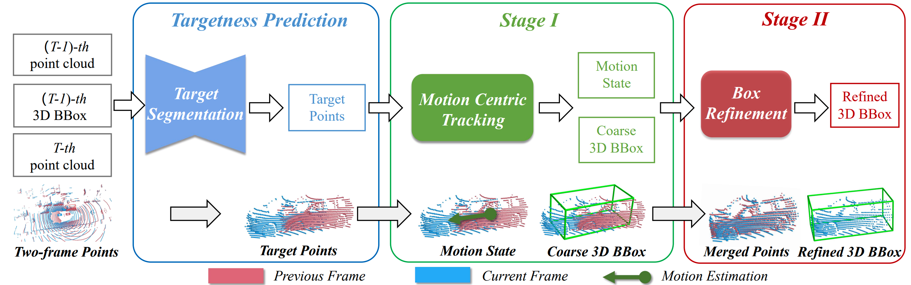
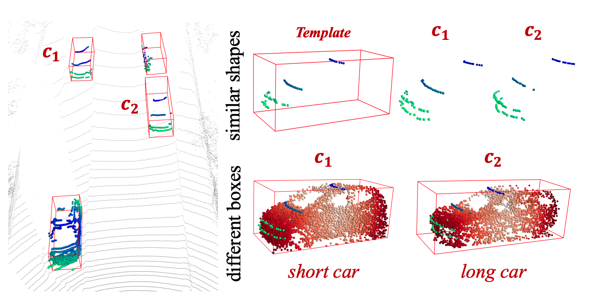
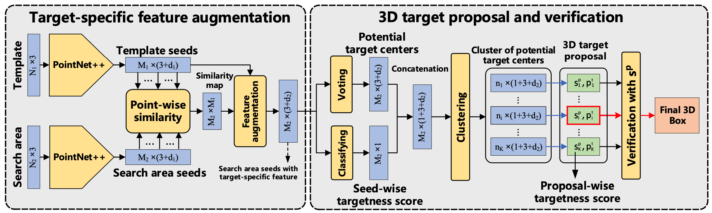

# Open3DSOT
A general python framework for single object tracking in LiDAR point clouds, based on PyTorch Lightning.

The official code release of **[BAT](https://arxiv.org/abs/2108.04728)** and **[M2 Track](https://ghostish.github.io/MM-Track/)**.


### Features
+ Modular design. It is easy to config the model and training/testing behaviors through just a `.yaml` file.
+ DDP support for both training and testing.
+ Support all common tracking datasets (KITTI, NuScenes, Waymo Open Dataset).

### :mega:  One tracking paper is accepted by CVPR2022 (Oral)! :point_down:
+ [Beyond 3D Siamese Tracking: A Motion-Centric Paradigm for 3D Single Object Tracking in Point Clouds](https://arxiv.org/abs/2203.01730)

### :mega: The codes for M2-Track is now available.
+ The checkpoints we provide here achieve better performances than those reported in our main paper. Check below for more details.
## Trackers
This repository includes the implementation of the following models:

### M2-Track (CVPR2022 Oral)
**[[Paper]](http://arxiv.org/abs/2203.01730)** **[[Project Page]](https://ghostish.github.io/MM-Track/)**

**M2-Track** is the first **motion-centric tracker** in LiDAR SOT, which robustly handles distractors and drastic appearance changes in complex driving scenes.  Unlike previous methods, M2-Track is a **matching-free** two-stage tracker which localizes the targets by explicitly modeling the "relative target motion" among frames.

<p align="center">

</p>

<p align="center">

</p>

### BAT (ICCV2021)
**[[Paper]](https://arxiv.org/abs/2108.04728) [[Results]](./README.md#Reproduction)**

Official implementation of **BAT**. BAT uses the BBox information to compensate the information loss of incomplete scans. It augments the target template with box-aware features that efficiently and effectively improve appearance matching.

<p align="center">

</p>
<p align="center">

</p>

### P2B (CVPR2020)
**[[Paper]](https://arxiv.org/abs/2005.13888) [[Official implementation]](https://github.com/HaozheQi/P2B)**

Third party implementation of **P2B**. Our implementation achieves better results than the official code release. P2B adapts SiamRPN to 3D point clouds by integrating a pointwise correlation operator with a point-based RPN (VoteNet).

<p align="center">

</p>

## Setup
Installation
+ Create the environment
  ```
  git clone https://github.com/Ghostish/Open3DSOT.git
  cd Open3DSOT
  conda create -n Open3DSOT  python=3.8
  conda activate Open3DSOT
  ```
+ Install pytorch
  ```
  conda install pytorch==1.7.1 torchvision==0.8.2 torchaudio==0.7.2 cudatoolkit=11.0 -c pytorch
  ```
  Our code is compatible with other PyTorch/CUDA versions. You can follow [this](https://pytorch.org/get-started/locally/) to install another version of pytorch. **Note: In order to reproduce the reported results with the provided checkpoints of BAT, please use CUDA 10.x.** 

+ Install other dependencies:
  ```
  pip install -r requirement.txt
  ```


KITTI dataset
+ Download the data for [velodyne](http://www.cvlibs.net/download.php?file=data_tracking_velodyne.zip), [calib](http://www.cvlibs.net/download.php?file=data_tracking_calib.zip) and [label_02](http://www.cvlibs.net/download.php?file=data_tracking_label_2.zip) from [KITTI Tracking](http://www.cvlibs.net/datasets/kitti/eval_tracking.php).
+ Unzip the downloaded files.
+ Put the unzipped files under the same folder as following.
  ```
  [Parent Folder]
  --> [calib]
      --> {0000-0020}.txt
  --> [label_02]
      --> {0000-0020}.txt
  --> [velodyne]
      --> [0000-0020] folders with velodynes .bin files
  ```

NuScenes dataset
+ Download the dataset from the [download page](https://www.nuscenes.org/download)
+ Extract the downloaded files and make sure you have the following structure:
  ```
  [Parent Folder]
    samples	-	Sensor data for keyframes.
    sweeps	-	Sensor data for intermediate frames.
    maps	        -	Folder for all map files: rasterized .png images and vectorized .json files.
    v1.0-*	-	JSON tables that include all the meta data and annotations. Each split (trainval, test, mini) is provided in a separate folder.
  ```
>Note: We use the **train_track** split to train our model and test it with the **val** split. Both splits are officially provided by NuScenes. During testing, we ignore the sequences where there is no point in the first given bbox.

Waymo dataset
+ Download and prepare dataset by the instruction of [CenterPoint](https://github.com/tianweiy/CenterPoint/blob/master/docs/WAYMO.md).
  ```
  [Parent Folder]
    tfrecord_training	                    
    tfrecord_validation	                 
    train 	                                    -	all training frames and annotations 
    val   	                                    -	all validation frames and annotations 
    infos_train_01sweeps_filter_zero_gt.pkl
    infos_val_01sweeps_filter_zero_gt.pkl
  ```
+ Prepare SOT dataset. Data from specific category and split will be merged (e.g., sot_infos_vehicle_train.pkl).
```bash
  python datasets/generate_waymo_sot.py
```

## Quick Start
### Training
To train a model, you must specify the `.yaml` file with `--cfg` argument. The `.yaml` file contains all the configurations of the dataset and the model. We provide `.yaml` files under the [*cfgs*](./cfgs) directory. **Note:** Before running the code, you will need to edit the `.yaml` file by setting the `path` argument as the correct root of the dataset.
```bash
CUDA_VISIBLE_DEVICES=0,1 python main.py  --cfg cfgs/M2_track_kitti.yaml  --batch_size 64 --epoch 60 --preloading
```
For M2-Track, we use the same configuration for all categories. By default, the `.yaml` is used to trained a Car tracker. You need to change the `category_name` in the `.yaml` file to train for another category.

In this version, we remove the `--gpus` flag. And all the available GPUs will be used by default. You can use `CUDA_VISIBLE_DEVICES` to select specific GPUs.

After you start training, you can start Tensorboard to monitor the training process:
```
tensorboard --logdir=./ --port=6006
```
By default, the trainer runs a full evaluation on the full test split after training every epoch. You can set `--check_val_every_n_epoch` to a larger number to speed up the training. The `--preloading` flag is used to preload the training samples into the memory to save traning time. Remove this flag if you don't have enough memory.
### Testing
To test a trained model, specify the checkpoint location with `--checkpoint` argument and send the `--test` flag to the command.
```bash
python main.py  --cfg cfgs/M2_track_kitti.yaml  --checkpoint /path/to/checkpoint/xxx.ckpt --test
```

## Reproduction
| Model | Category | Success| Precision| Checkpoint
|--|--|--|--|--|
| BAT-KITTI | Car	|65.37 | 78.88|pretrained_models/bat_kitti_car.ckpt
| BAT-NuScenes | Car	|40.73 | 43.29|pretrained_models/bat_nuscenes_car.ckpt
| BAT-KITTI | Pedestrian | 45.74| 74.53| pretrained_models/bat_kitti_pedestrian.ckpt
| M2Track-KITTI | Car | **67.43**| **81.04**| pretrained_models/mmtrack_kitti_car.ckpt
| M2Track-KITTI | Pedestrian | **60.61**| **89.39**| pretrained_models/mmtrack_kitti_pedestrian.ckpt

Trained models are provided in the  [*pretrained_models*](./pretrained_models) directory. To reproduce the results, simply run the code with the corresponding `.yaml` file and checkpoint. For example, to reproduce the tracking results on KITTI Car of M2-Track, just run:
```bash
python main.py  --cfg cfgs/M2_track_kitti.yaml  --checkpoint ./pretrained_models/mmtrack_kitti_car.ckpt --test
```
The reported results of M2-Track checkpoints are produced on 3090/3080ti GPUs. Due to the precision issues, there could be minor differences if you test them with other GPUs.

## Acknowledgment
+ This repo is built upon [P2B](https://github.com/HaozheQi/P2B) and [SC3D](https://github.com/SilvioGiancola/ShapeCompletion3DTracking).
+ Thank Erik Wijmans for his pytorch implementation of [PointNet++](https://github.com/erikwijmans/Pointnet2_PyTorch)

## License
This repository is released under MIT License (see LICENSE file for details).
